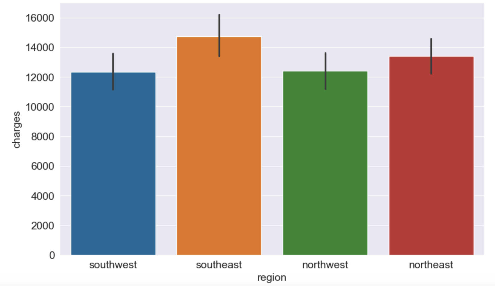
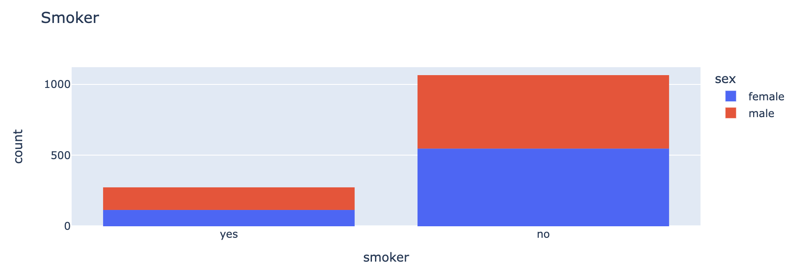
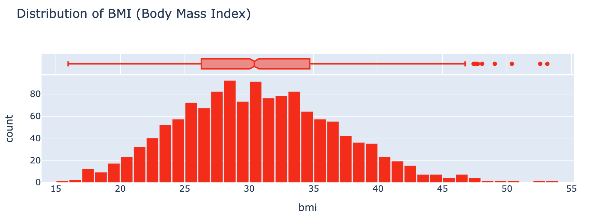
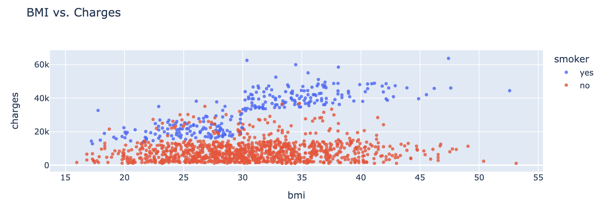
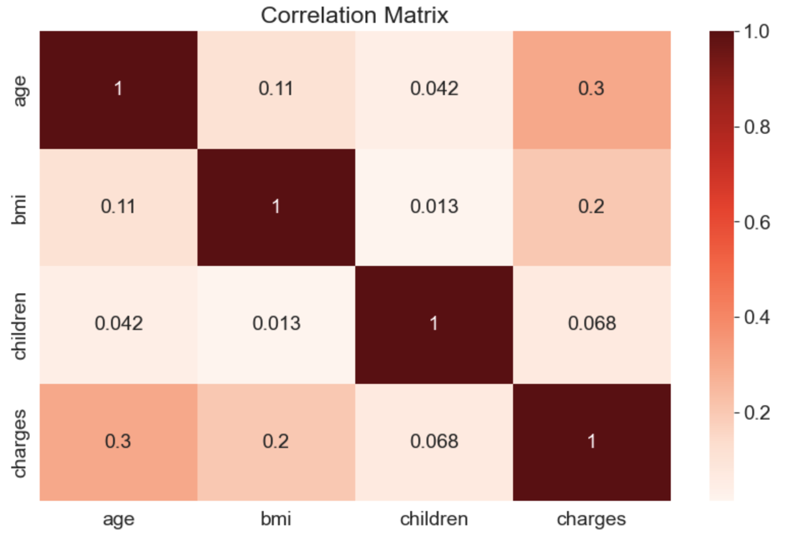

## Summary and Further Reading

We've covered the following topics in this project:

- Downloading and exploring a dataset for machine learning
- Linear regression with one variable using Scikit-learn
- Linear regression with multiple variables
- Using categorical features for machine learning
- Regression coefficients and feature importance
- Creating a training and test set for reporting results

